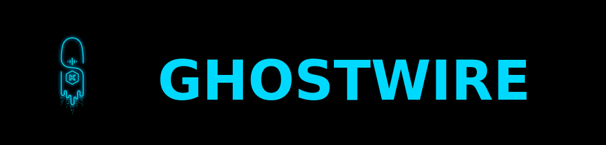

<div align="center">



## Cloud-Native Signal Desktop for Kubernetes

Run Signal Desktop in your cluster with browser access and persistent storage

[](LICENSE)
[](https://github.com/drengskapur/ghostwire/releases)
[](https://github.com/drengskapur/ghostwire/actions/workflows/helm-release.yml)
[](https://artifacthub.io/packages/search?repo=ghostwire)
[](https://scorecard.dev/viewer/?uri=github.com/drengskapur/ghostwire)

</div>

---

## What This Does

Deploys Signal Desktop in Kubernetes with:

- Browser-based VNC access (no client needed)
- Persistent storage (conversations survive pod restarts)
- Integration with your existing infrastructure (OAuth2, ingress, cert-manager)

<div align="center">


</div>

---

## Quick Start

Install the chart:

```bash
helm install ghostwire oci://ghcr.io/drengskapur/charts/ghostwire --version 1.0.0 --create-namespace -n ghostwire
```

Access via port-forward:

```bash
kubectl port-forward -n ghostwire svc/ghostwire 6901:6901
```

Open in browser:

```text
http://localhost:6901?keyboard=1
```

**Note:** VNC authentication is disabled by default. For production use, configure ingress with OAuth2 instead of port-forwarding. See [Chart README](chart/README.md).

---

## Why This Exists

Most VNC-in-Kubernetes solutions bundle their own authentication, TLS termination, and security controls. This creates redundant configuration and conflicts with platform-level security tools.

Ghostwire takes a different approach: **delegate infrastructure concerns to infrastructure**.

**What we don't include:**

- Built-in authentication (use OAuth2-proxy or similar)
- Built-in TLS (use cert-manager)
- Custom ingress configuration (use your existing ingress controller)

**What we do well:**

- Run Signal Desktop reliably in a container
- Persist your data correctly (StatefulSet + PVC)
- Expose VNC via standard Service
- Stay out of your infrastructure's way

This means less configuration overlap and easier integration with tools you already use.

---

## Architecture


Clean separation: the chart handles the application runtime, your platform handles everything else.

---

## Configuration

The chart exposes 60+ Helm values. Key parameters:

| Parameter | Default | Description |
|-----------|---------|-------------|
| `persistence.size` | `10Gi` | Signal data volume size |
| `resources.limits.memory` | `4Gi` | Memory limit |
| `resources.requests.cpu` | `500m` | CPU request |
| `image.tag` | `1.18.0-rolling-daily` | Signal Desktop version |

See [values.yaml](chart/values.yaml) for complete options and [values.schema.json](chart/values.schema.json) for validation.

---

## Documentation

- **[Chart README](chart/README.md)** - Installation guide and configuration reference
- **[Container Architecture](docs/container-architecture.md)** - How the runtime works
- **[Deployment Strategies](docs/deployment-strategies.md)** - StatefulSet design and rollout behavior
- **[Infrastructure Integration](docs/infrastructure-integration-guide.md)** - Patterns for OAuth2, ingress, cert-manager
- **[Testing Strategy](docs/testing-strategy.md)** - Testing approach and quality assurance
- **[Fuzzing Strategy](docs/fuzzing-strategy.md)** - Property-based testing and fuzzing approach
- **[OpenSSF Best Practices Guide](docs/openssf-best-practices.md)** - Security badge application guide
- **[Code Review Strategy](docs/code-review-strategy.md)** - Single-maintainer approach and co-maintainer call

---

## Contributing

**Looking for Co-Maintainers!** This project is actively seeking additional maintainers to help with code review, issue triage, and feature development. If you're interested, please see [Code Review Strategy](docs/code-review-strategy.md) and reach out via [GitHub Discussions](https://github.com/drengskapur/ghostwire/discussions).

Contributions welcome. See [CONTRIBUTING.md](CONTRIBUTING.md) for:

- Development environment setup
- Testing requirements
- Commit message conventions
- Pull request guidelines

---

## License

- **This Helm chart:** Apache License 2.0 ([LICENSE](LICENSE))
- **Signal Desktop:** AGPLv3 ([Signal Messenger LLC](https://signal.org))
- **Kasm container images:** MIT License ([Kasm Technologies Inc](https://kasmweb.com))

See [NOTICE](NOTICE) for third-party software attributions.

**Important:** Signal Messenger LLC and Kasm Technologies Inc do not endorse or support this project.

---

## Built With

- [Signal Desktop](https://github.com/signalapp/Signal-Desktop) - Encrypted messaging application
- [Kasm Workspaces](https://github.com/kasmtech/workspaces-images) - Containerized desktop streaming
- [KasmVNC](https://github.com/kasmtech/KasmVNC) - VNC server with HTML5 client
- [XFCE](https://xfce.org/) - Lightweight desktop environment

---

## Support

- **Documentation:** [chart/README.md](chart/README.md)
- **Bug Reports:** [GitHub Issues](https://github.com/drengskapur/ghostwire/issues)
- **Questions:** [GitHub Discussions](https://github.com/drengskapur/ghostwire/discussions)
