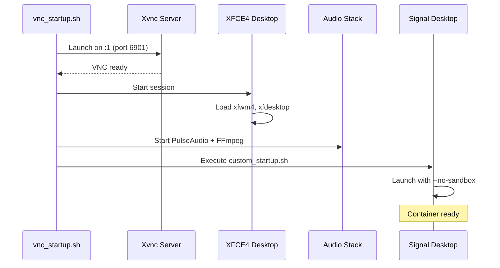
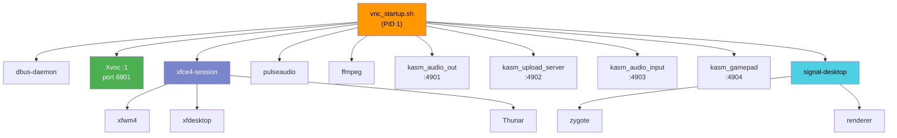

# Container Runtime

Ghostwire uses Kasm Technologies' Signal Desktop container image. Understanding the runtime architecture helps with troubleshooting and resource planning.

## Container Stack

The container runs several components that work together to provide a browser-accessible Signal Desktop:

**Xvnc** — Virtual framebuffer X server with built-in VNC. Runs the graphical display on `:1` and handles VNC connections on port 6901.

**XFCE4** — Lightweight desktop environment providing window management and basic desktop functionality.

**KasmVNC** — Fork of TigerVNC with HTML5 web client. Provides the browser-based access without requiring a native VNC client.

**PulseAudio + FFmpeg** — Audio stack for sound output. FFmpeg encodes audio for streaming to the browser.

**Signal Desktop** — The Electron-based messaging application, running with `--no-sandbox` flag (sandboxing is handled at the container level).

## Startup Sequence

When the container starts:



The container is ready when Signal Desktop's window appears in the VNC session.

## Process Tree



## Resource Usage

Typical memory consumption:

| Component | Memory |
|-----------|--------|
| Xvnc | ~80 MB |
| XFCE4 session | ~80 MB |
| FFmpeg | ~45 MB |
| PulseAudio | ~15 MB |
| Signal Desktop | ~400-800 MB |
| **Total** | **~700 MB - 1.2 GB** |

Signal Desktop memory usage scales with conversation count and media. Heavy usage can reach 2-3 GB.

The default resource limits (4GB memory, 2 CPU) accommodate typical usage with headroom for spikes.

## Network Ports

| Port | Protocol | Service |
|------|----------|---------|
| 6901 | TCP/UDP | Xvnc (primary VNC access) |
| 4901 | WebSocket | Audio output streaming |
| 4902 | HTTPS | File upload |
| 4903 | WebSocket | Audio input (microphone) |
| 4904 | WebSocket | Gamepad input |

The Kubernetes Service exposes port 6901. Other ports are used internally for feature communication between the browser client and container.

## Filesystem Layout

```
/home/kasm-user/
├── .config/
│   └── Signal/           # Signal configuration, encryption keys
├── .local/
│   └── share/
│       └── Signal/       # Message database, attachments
├── Desktop/              # XFCE desktop files
└── .kasmpasswd           # VNC authentication (if enabled)
```

The PVC mounts at `/home/kasm-user` to persist all user data.

## Signal Desktop Configuration

Signal Desktop runs with these flags:

- `--no-sandbox` — Chromium sandbox is disabled (container provides isolation)
- Uses Electron's default rendering pipeline

The application auto-starts via XFCE autostart or `custom_startup.sh`.

## Health Indicators

The container is healthy when:

- Xvnc is listening on port 6901
- Signal Desktop window is visible
- No crash loops in the Signal process

The Helm chart configures liveness and readiness probes on port 6901.

## Customization

Environment variables for the Kasm container:

| Variable | Description |
|----------|-------------|
| `VNC_PW` | VNC password (if using native VNC auth) |
| `VNC_RESOLUTION` | Display resolution (e.g., `1920x1080`) |
| `TZ` | Timezone |

See the [Kasm documentation](https://kasmweb.com/docs) for additional configuration options.
