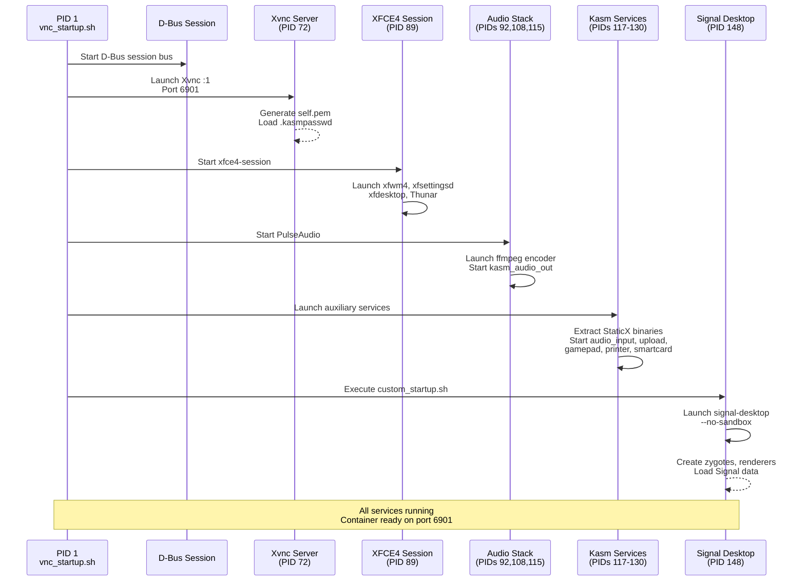
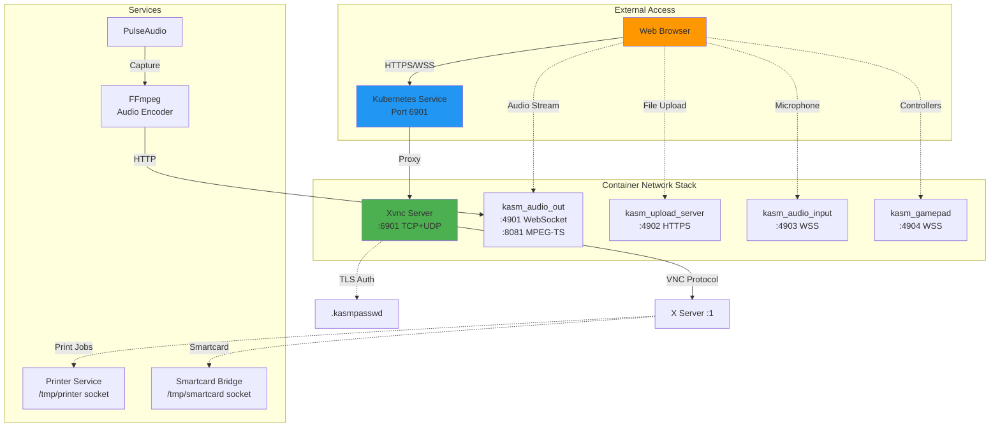
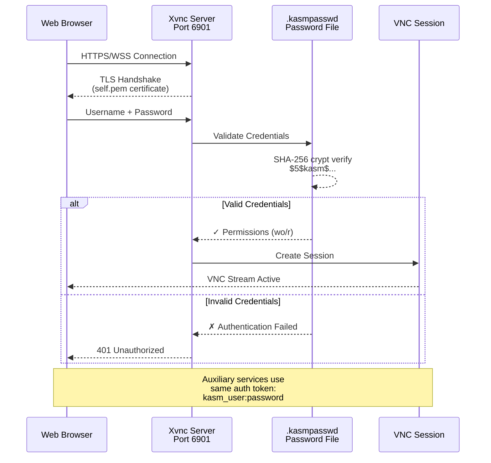
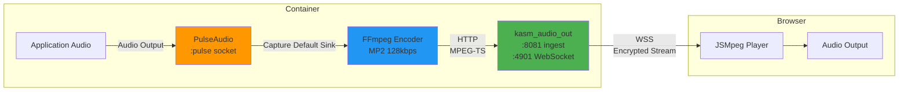

# Ghostwire Container Architecture

## Overview

This document provides a detailed analysis of the Ghostwire container runtime architecture, startup sequence, process tree, filesystem structure, and configuration mechanisms based on live inspection of a running container.

**Container Base Image**: `kasmweb/signal:1.18.0-rolling-daily`
**Primary Components**: KasmVNC + Signal Desktop + XFCE4 Desktop Environment

---

## Architecture Diagrams

### Container Startup Sequence



### Network Architecture



### Process Hierarchy

```mermaid
graph TD
    PID1[PID 1: vnc_startup.sh<br/>Entry Point]

    PID1 --> DBus[PID 19: dbus-daemon<br/>Session Bus]
    PID1 --> Xvnc[PID 72: Xvnc :1<br/>81MB RAM]
    PID1 --> XFCE[PID 89: xfce4-session<br/>80MB RAM]
    PID1 --> AudioOut[PID 92: kasm_audio_out<br/>40MB RAM]
    PID1 --> Pulse[PID 108: pulseaudio<br/>15MB RAM]
    PID1 --> FFmpeg[PID 115: ffmpeg<br/>46MB RAM]
    PID1 --> AudioIn[PID 117: audio_input<br/>Parent]
    PID1 --> UploadSrv[PID 119: upload_server<br/>Parent]
    PID1 --> GamepadSrv[PID 121: gamepad_server<br/>Parent]
    PID1 --> PrintSrv[PID 124: printer_service<br/>Parent]
    PID1 --> SmartSrv[PID 130: smartcard_bridge<br/>Parent]
    PID1 --> Signal[PID 148: signal-desktop<br/>383MB RAM]

    XFCE --> WM[PID 192: xfwm4]
    XFCE --> Settings[PID 220: xfsettingsd]
    XFCE --> Thunar[PID 233: Thunar]
    XFCE --> Desktop[PID 334: xfdesktop]
    XFCE --> Notify[PID 476: xfce4-notifyd]

    AudioIn --> AudioInChild[PID 234: staticx<br/>PID 241: worker]
    UploadSrv --> UploadChild[PID 263: staticx<br/>PID 362: Flask worker]
    GamepadSrv --> GamepadChild[PID 258: staticx<br/>PID 281: worker]
    PrintSrv --> PrintChild[PID 256: staticx<br/>PID 272: worker]
    SmartSrv --> SmartChild[PID 257: staticx<br/>PID 269: worker]

    Signal --> Zygote1[PID 159: zygote]
    Signal --> Zygote2[PID 160: zygote]
    Signal --> Network[PID 289: network service<br/>78MB RAM]
    Signal --> ZygoteGPU[PID 402: zygote GPU]
    Signal --> Renderer[PID 427: renderer<br/>258MB RAM]

    style PID1 fill:#FF9800
    style Xvnc fill:#4CAF50
    style Signal fill:#E91E63
    style XFCE fill:#2196F3
```



### Authentication Flow



### Data Flow - Audio Streaming



### Filesystem Persistence

```mermaid
graph TB
    subgraph "PersistentVolumeClaim"
        PVC[/home/kasm-user<br/>RWO Volume]
    end

    subgraph "Critical Paths"
        Signal[.config/Signal/<br/>MUST PERSIST]
        VNC[.vnc/<br/>Logs & Config]
        Uploads[Uploads/<br/>User Files]
        PDF[PDF/<br/>Print Output]
        Desktop[Desktop/<br/>User Files]
    end

    subgraph "Signal Data"
        IndexDB[IndexedDB/<br/>Messages DB]
        Blob[blob_storage/<br/>Attachments]
        Config[config.json<br/>Device Keys]
        SQL[sql/<br/>Encrypted DB]
    end

    subgraph "Ephemeral Paths"
        Tmp[/tmp/staticx-*<br/>Service Binaries]
        Sockets[/tmp/*.socket<br/>Unix Sockets]
    end

    PVC --> Signal
    PVC --> VNC
    PVC --> Uploads
    PVC --> PDF
    PVC --> Desktop

    Signal --> IndexDB
    Signal --> Blob
    Signal --> Config
    Signal --> SQL

    style Signal fill:#E91E63
    style PVC fill:#4CAF50
    style IndexDB fill:#FF9800
    style Config fill:#FF9800
```

---

## Table of Contents

1. [Container Startup Sequence](#container-startup-sequence)
2. [Process Architecture](#process-architecture)
3. [Filesystem Structure](#filesystem-structure)
4. [Network Services](#network-services)
5. [Authentication System](#authentication-system)
6. [TLS/SSL Configuration](#tlsssl-configuration)
7. [Environment Variables](#environment-variables)
8. [Signal Desktop Integration](#signal-desktop-integration)
9. [KasmVNC Features](#kasmvnc-features)

---

## Container Startup Sequence

### Phase 1: Initialization (PID 1)

**Entry Point**: `/dockerstartup/vnc_startup.sh`
- Launched by `/bin/bash /dockerstartup/vnc_startup.sh /dockerstartup/kasm_startup.sh --wait`
- Executes as `kasm-user` (UID 1000, GID 1000)

**Startup Script Flow**:
```bash
1. D-Bus session bus initialization
2. X server (Xvnc) startup
3. Window manager initialization (XFCE4)
4. Audio services startup
5. KasmVNC auxiliary services
6. Custom application startup (Signal Desktop)
```

### Phase 2: X Server and VNC (PID 72)

**Xvnc Process**: Multi-threaded VNC server with integrated X server

**Key Launch Parameters**:
```bash
/usr/bin/Xvnc :1 \
  -depth 24 \
  -geometry 1024x768 \
  -httpd /usr/share/kasmvnc/www \
  -websocketPort 6901 \
  -interface 0.0.0.0 \
  -cert /home/kasm-user/.vnc/self.pem \
  -key /home/kasm-user/.vnc/self.pem \
  -KasmPasswordFile /home/kasm-user/.kasmpasswd \
  -rfbauth /home/kasm-user/.vnc/passwd \
  -FrameRate 60 \
  -MaxVideoResolution 1920x1080 \
  -DynamicQualityMin 7 \
  -DynamicQualityMax 8 \
  -sslOnly 0
```

**Display Configuration**:
- Display: `:1` (DISPLAY environment variable)
- Default resolution: `1024x768` (configurable via `VNC_RESOLUTION`)
- Max resolution: `1920x1080`
- Frame rate: 60 FPS (default 24 FPS, overridden)
- Color depth: 24-bit

### Phase 3: Window Manager (PID 89, 192)

**XFCE4 Session Components**:
1. `xfce4-session` (PID 89) - Session manager
2. `xfwm4` (PID 192) - Window manager with compositing
3. `xfsettingsd` (PID 220) - Settings daemon
4. `xfdesktop` (PID 334) - Desktop manager
5. `Thunar` (PID 233) - File manager (daemon mode)
6. `xfce4-notifyd` (PID 476) - Notification daemon

**Startup Output**:
```
------------------ Xfce4 window manager startup------------------
Starting XFCE
/usr/bin/startxfce4: X server already running on display :1
```

**Other Window Managers**: OpenBox and KDE are available but skipped by default.

### Phase 4: Audio Services (PIDs 92, 108, 115)

**Audio Stack**:
1. **PulseAudio** (PID 108) - Audio server
   ```bash
   pulseaudio --start
   ```

2. **Kasm Audio Out** (PID 92) - Audio streaming server
   ```bash
   /dockerstartup/jsmpeg/kasm_audio_out-linux \
     kasmaudio 8081 4901 \
     /home/kasm-user/.vnc/self.pem \
     /home/kasm-user/.vnc/self.pem \
     kasm_user:CorrectHorseBatteryStaple
   ```
   - Listens on port 8081 (MPEG-TS stream ingestion)
   - WebSocket server on port 4901 (audio streaming to browser)
   - Uses self-signed TLS certificate
   - Requires authentication token

3. **FFmpeg Audio Encoder** (PID 115) - Audio capture and encoding
   ```bash
   ffmpeg -v verbose \
     -f pulse \
     -fragment_size 2000 \
     -ar 44100 \
     -i default \
     -f mpegts \
     -correct_ts_overflow 0 \
     -codec:a mp2 \
     -b:a 128k \
     -ac 1 \
     -muxdelay 0.001 \
     http://127.0.0.1:8081/kasmaudio
   ```
   - Captures from PulseAudio default sink
   - Sample rate: 44.1 kHz
   - Codec: MP2 at 128 kbps
   - Mono output

### Phase 5: KasmVNC Auxiliary Services

**Service Overview**:
| Service | PID | Port | Purpose |
|---------|-----|------|---------|
| Audio Input | 117/234/241 | 4903 | Microphone streaming from browser |
| Upload Server | 119/263/362 | 4902 | File upload to container |
| Gamepad Server | 121/258/281 | 4904 | Game controller passthrough |
| Printer Service | 124/256/272 | Unix socket | PDF printing (/home/kasm-user/PDF) |
| Smartcard Bridge | 130/257/269 | Unix socket | Smartcard/PKCS#11 support |

**Implementation Details**:
- All services use **StaticX** packaging (self-extracting to `/tmp/staticx-*`)
- TLS-enabled with self-signed certificates
- Token-based authentication: `kasm_user:CorrectHorseBatteryStaple`
- Services run as multiple processes (parent + child)

**Audio Input Server**:
```bash
/dockerstartup/audio_input/kasm_audio_input_server \
  --ssl \
  --auth-token kasm_user:CorrectHorseBatteryStaple \
  --cert /home/kasm-user/.vnc/self.pem \
  --certkey /home/kasm-user/.vnc/self.pem
```

**Upload Server**:
```bash
/dockerstartup/upload_server/kasm_upload_server \
  --ssl \
  --auth-token kasm_user:CorrectHorseBatteryStaple \
  --port 4902 \
  --upload_dir /home/kasm-user/Uploads
```
- Flask-based Python application
- HTTPS on port 4902
- Files uploaded to `/home/kasm-user/Uploads`

**Printer Service**:
```bash
/dockerstartup/printer/kasm_printer_service \
  --directory /home/kasm-user/PDF \
  --relay /tmp/printer
```
- Monitors Unix socket `/tmp/printer`
- Saves PDFs to `/home/kasm-user/PDF`
- Python-based service

### Phase 6: Signal Desktop Application (PID 148)

**Launch Command**:
```bash
signal-desktop --no-sandbox
```

**Process Tree**:
```
148: signal-desktop (main process)
├── 159: zygote (no sandbox)
├── 160: zygote (no sandbox)
├── 289: utility process (network service)
├── 402: zygote (GPU process helper)
└── 427: renderer process (Chromium renderer)
```

**Key Characteristics**:
- Based on Electron/Chromium
- Runs with `--no-sandbox` flag (required in containerized environment)
- Multi-process architecture (zygotes, renderers, utility processes)
- GPU acceleration disabled (software rendering fallback)

**User Data Directory**: `/home/kasm-user/.config/Signal`

**Startup Behavior**:
- Launched by `/dockerstartup/custom_startup.sh`
- Auto-restart loop if process exits
- Window maximization via `/dockerstartup/maximize_window.sh`
- Environment variables:
  ```bash
  MAXIMIZE=true
  MAXIMIZE_NAME=Signal
  ```

**Startup Errors (Expected/Non-Fatal)**:
```
ERROR:dbus/bus.cc:408] Failed to connect to the bus: /run/dbus/system_bus_socket
ERROR:zygote_host_impl_linux.cc:283] Failed to adjust OOM score: Permission denied
ERROR:viz_main_impl.cc:189] Exiting GPU process due to errors during initialization
```
- D-Bus system bus unavailable (only session bus needed)
- OOM score adjustment denied (requires CAP_SYS_ADMIN)
- GPU initialization fails (falls back to software rendering)

---

## Process Architecture

### Complete Process Tree

```
PID 1: /bin/bash /dockerstartup/vnc_startup.sh
│
├─── PID 19: dbus-daemon (session bus)
│
├─── PID 72: Xvnc :1 (VNC + X server)
│
├─── PID 89: xfce4-session
│    ├─── PID 192: xfwm4 (window manager)
│    ├─── PID 220: xfsettingsd
│    ├─── PID 233: Thunar --daemon
│    ├─── PID 334: xfdesktop
│    └─── PID 476: xfce4-notifyd
│
├─── PID 92: kasm_audio_out-linux
│
├─── PID 108: pulseaudio
│
├─── PID 115: ffmpeg (audio encoder)
│
├─── PID 117: kasm_audio_input_server (parent)
│    ├─── PID 234: (child, staticx)
│    └─── PID 241: (worker)
│
├─── PID 119: kasm_upload_server (parent)
│    ├─── PID 263: (child, staticx)
│    └─── PID 362: (worker, Flask)
│
├─── PID 121: kasm_gamepad_server (parent)
│    ├─── PID 258: (child, staticx)
│    └─── PID 281: (worker)
│
├─── PID 124: kasm_printer_service (parent)
│    ├─── PID 256: (child, staticx)
│    └─── PID 272: (worker)
│
├─── PID 126: pcscd (smartcard daemon)
│
├─── PID 130: kasm_smartcard_bridge (parent)
│    ├─── PID 257: (child, staticx)
│    └─── PID 269: (worker)
│
├─── PID 131: tail -f /home/kasm-user/.vnc/ghostwire-dev-0:1.log
│
├─── PID 134: bash /dockerstartup/custom_startup.sh
│    └─── PID 147: bash /dockerstartup/maximize_window.sh
│
├─── PID 148: signal-desktop (main)
│    ├─── PID 159: zygote (no sandbox)
│    ├─── PID 160: zygote
│    ├─── PID 289: utility process (network)
│    ├─── PID 402: zygote (GPU)
│    └─── PID 427: renderer process
│
├─── PID 143: at-spi-bus-launcher (accessibility)
│    └─── PID 152: dbus-daemon (at-spi)
│
├─── PID 158: xfconfd (XFCE config daemon)
│
├─── PID 166: at-spi2-registryd
│
├─── PID 185: ssh-agent
│
├─── PID 190: gpg-agent
│
├─── PID 207: gvfsd (virtual filesystem)
│
├─── PID 478: gvfsd-metadata
│
└─── PID 482: xiccd (color management)
```

### Resource Usage Snapshot

```
USER         PID %CPU %MEM    VSZ   RSS
kasm-user      1  0.1  0.0 120636  3968  (vnc_startup.sh)
kasm-user     72  1.1  0.3 425368 81060  (Xvnc)
kasm-user     89  0.3  0.3 574192 79980  (xfce4-session)
kasm-user     92  0.3  0.1 554768 40288  (kasm_audio_out)
kasm-user    108  0.4  0.0 654056 14888  (pulseaudio)
kasm-user    115  0.5  0.1 639176 45696  (ffmpeg)
kasm-user    148  9.2  1.4 1292362476 382720  (signal-desktop)
kasm-user    289  0.1  0.2 34026620 77944  (network service)
kasm-user    427  4.7  0.9 1283631212 257936  (renderer)
```

**Total Container Memory**: ~1.2 GB RSS (typical usage)

---

## Filesystem Structure

### Home Directory Layout (`/home/kasm-user`)

```
/home/kasm-user/
├── .bashrc                     # Bash configuration
├── .cache/                     # Application cache
├── .config/                    # Application configurations
│   └── Signal/                 # Signal Desktop data (CRITICAL - must persist)
│       ├── blob_storage/       # Message attachments
│       ├── Cache/              # Electron cache
│       ├── Code Cache/         # V8 code cache
│       ├── config.json         # Signal configuration
│       ├── Crashpad/           # Crash reports
│       ├── DIPS                # SQLite database (privacy settings)
│       ├── DIPS-wal            # SQLite write-ahead log
│       ├── ephemeral.json      # Temporary session data
│       ├── GPUCache/           # GPU shader cache
│       ├── IndexedDB/          # Message database (CRITICAL)
│       ├── Local Storage/      # Local storage data
│       ├── logs/               # Application logs
│       ├── Preferences         # User preferences
│       ├── sql/                # SQLite databases
│       ├── Trust Tokens        # Cryptographic tokens
│       └── WebStorage/         # Web storage data
├── Desktop/                    # Desktop files
├── Documents/                  # User documents
├── Downloads/                  # Download directory
├── .gnupg/                     # GPG keyring
│   └── private-keys-v1.d/      # Private keys
├── .ICEauthority               # X11 ICE authority
├── .kasmpasswd                 # KasmVNC password file
├── .local/                     # Local application data
├── Music/                      # Music directory
├── PDF/                        # PDF printer output
├── Pictures/                   # Pictures directory
├── .pki/                       # Public key infrastructure
├── Public/                     # Public files
├── Templates/                  # File templates
├── Uploads/                    # Web upload destination
├── Videos/                     # Videos directory
├── .vnc/                       # VNC configuration and logs
│   ├── .de-was-selected        # Desktop environment marker
│   ├── ghostwire-dev-0:1.log   # VNC server log
│   ├── ghostwire-dev-0:1.pid   # VNC server PID file
│   ├── kasmvnc.yaml            # KasmVNC configuration
│   ├── passwd                  # Legacy VNC password file
│   ├── self.pem                # Self-signed TLS certificate + key
│   └── xstartup                # X session startup script
└── .Xauthority                 # X11 authentication cookie
```

### Application Directories

**Signal Desktop Binary**: `/opt/Signal/`
```
/opt/Signal/
├── chrome_100_percent.pak      # Chrome UI assets
├── chrome_200_percent.pak      # High-DPI assets
├── chrome_crashpad_handler     # Crash handler
├── chrome-sandbox              # SUID sandbox (setuid root)
├── icudtl.dat                  # ICU data (internationalization)
├── libEGL.so                   # OpenGL ES library
├── libffmpeg.so                # FFmpeg codecs
├── libGLESv2.so                # OpenGL ES 2.0
├── libvk_swiftshader.so        # Vulkan software renderer
├── libvulkan.so.1              # Vulkan loader
├── LICENSE.electron.txt        # Electron license
├── LICENSES.chromium.html      # Chromium licenses
├── locales/                    # Localization files
├── resources/                  # Application resources
│   └── app.asar                # Signal app bundle (ASAR archive)
├── resources.pak               # Chromium resources
├── signal-desktop              # Main executable (203 MB)
├── snapshot_blob.bin           # V8 snapshot
├── v8_context_snapshot.bin     # V8 context snapshot
└── vk_swiftshader_icd.json     # Vulkan ICD manifest
```

**KasmVNC Startup Scripts**: `/dockerstartup/`
```
/dockerstartup/
├── audio_input/                # Audio input server binaries
├── custom_startup.sh           # Application-specific startup
├── emblems.sh                  # Desktop emblem configuration
├── gamepad/                    # Gamepad server binaries
├── generate_container_user     # User creation script
├── install/                    # Installation scripts
├── jsmpeg/                     # Audio streaming server
│   └── kasm_audio_out-linux    # Audio encoder binary
├── kasm_default_profile.sh     # Default user profile
├── kasm_end_session_recoverable.sh  # Session recovery
├── kasm_post_run_root.sh       # Post-run hook (root)
├── kasm_post_run_user.sh       # Post-run hook (user)
├── kasm_pre_shutdown_root.sh   # Pre-shutdown hook (root)
├── kasm_pre_shutdown_user.sh   # Pre-shutdown hook (user)
├── kasmrx/                     # KasmRX streaming protocol
├── maximize_window.sh          # Window maximization script
├── printer/                    # Printer service binaries
├── recorder/                   # Session recorder
├── set_user_permission.sh      # Permission setup
├── smartcard/                  # Smartcard bridge binaries
├── trustdesktop.sh             # Desktop trust configuration
├── upload_server/              # Upload server binaries
├── vnc_startup.sh              # Main VNC startup script (25 KB)
├── webcam/                     # Webcam passthrough
└── window_manager_startup.log  # WM startup log
```

### Temporary Directories

**StaticX Extraction**: `/tmp/staticx-*/`
- Each Kasm service extracts to a unique temporary directory
- Contains unpacked binary and dependencies
- Examples:
  ```
  /tmp/staticx-kPBinD/    → kasm_audio_input_server
  /tmp/staticx-CkbbDG/    → kasm_upload_server
  /tmp/staticx-MGFlfN/    → kasm_gamepad_server
  /tmp/staticx-fClIkE/    → kasm_printer_service
  /tmp/staticx-CMAPNP/    → kasm_smartcard_bridge
  ```

**Unix Sockets**:
- `/tmp/printer` - Printer relay socket
- `/tmp/smartcard` - Smartcard relay socket
- `/tmp/scoped_dir*/SingletonSocket` - Signal singleton socket

---

## Network Services

### Listening Ports

| Port | Protocol | Service | Purpose |
|------|----------|---------|---------|
| **6901** | TCP + UDP | Xvnc | WebSocket VNC connections (primary) |
| 4901 | TCP | kasm_audio_out | Audio WebSocket stream |
| 4902 | TCP | kasm_upload_server | HTTPS file upload |
| 4903 | TCP | kasm_audio_input_server | Audio input (microphone) |
| 4904 | TCP | kasm_gamepad_server | Gamepad input |
| 8081 | TCP | kasm_audio_out | MPEG-TS audio ingestion |
| 5901 | TCP | Xvnc (RFB) | Legacy VNC protocol (not exposed) |

**Primary Access Point**: Port 6901 (HTTP/HTTPS + WebSocket)
- Serves KasmVNC web client from `/usr/share/kasmvnc/www`
- Handles VNC protocol over WebSocket
- TLS enabled by default (unless `tls.mode: disabled`)

### Network Binding

```bash
netstat -tulpn output:
0.0.0.0:4903  (kasm_audio_input)   - All interfaces
0.0.0.0:4902  (kasm_upload_server) - All interfaces
0.0.0.0:4904  (kasm_gamepad)       - All interfaces
0.0.0.0:6901  (Xvnc)               - All interfaces
:::8081       (kasm_audio_out)     - IPv6 all interfaces
:::4901       (kasm_audio_out)     - IPv6 all interfaces
```

**External Access**: Only port 6901 is exposed by Kubernetes Service

---

## Authentication System

### KasmVNC Password File (`.kasmpasswd`)

**Location**: `/home/kasm-user/.kasmpasswd`

**Format**: Colon-separated fields
```
username:hashed_password:permissions
```

**Example**:
```
kasm_user:$5$kasm$liEQvAlcV49V2ZmUDqwFKcz9v2.HmvNFrvVKxBp2kW9:wo
kasm_viewer:$5$kasm$liEQvAlcV49V2ZmUDqwFKcz9v2.HmvNFrvVKxBp2kW9:r
```

**Fields**:
1. `username` - Login username
2. `hashed_password` - SHA-256 crypt hash (`$5$` prefix)
3. `permissions` - Access control flags:
   - `wo` - Write and own (full control)
   - `r` - Read-only (view-only mode)

**Password Hash Algorithm**: SHA-256 crypt (`$5$`)
- Salt: `kasm`
- Generated via: `mkpasswd -m sha-256 -S kasm <password>`

**Default Password**: `CorrectHorseBatteryStaple` (from `VNC_PW` env var)

### Legacy VNC Authentication (`.vnc/passwd`)

**Location**: `/home/kasm-user/.vnc/passwd`
**Size**: 8 bytes
**Purpose**: Legacy RFB protocol authentication (port 5901)
**Note**: Not used for WebSocket connections

### Authentication Tokens

**Kasm Services Token**: `kasm_user:CorrectHorseBatteryStaple`
- Used by audio, upload, gamepad, and printer services
- Passed via `--auth-token` parameter
- Format: `username:password` (plain text in args)

**Security Note**: All services use the same authentication token derived from `VNC_PW`.

### Authentication Flow

```
Client → HTTPS/WSS Port 6901
  ↓
Xvnc checks KasmPasswordFile
  ↓
Username + password validated against .kasmpasswd
  ↓
Session established with permission level (wo/r)
```

### Disabling Authentication

Set `auth.enabled: false` in Helm chart:
- Skips password file creation
- Allows anonymous access to VNC
- **WARNING**: Only use behind secure ingress/VPN

---

## TLS/SSL Configuration

### Self-Signed Certificate

**Location**: `/home/kasm-user/.vnc/self.pem`
**Format**: Combined PEM (certificate + private key)
**Size**: 3079 bytes
**Permissions**: `600` (owner read/write only)

**Certificate Details**:
```
Subject: C=US, ST=VA, L=None, O=None, OU=DoFu, CN=kasm, emailAddress=none@none.none
Issuer:  C=US, ST=VA, L=None, O=None, OU=DoFu, CN=kasm, emailAddress=none@none.none
Not Before: Oct 17 22:43:02 2025 GMT
Not After:  Oct 15 22:43:02 2035 GMT (10-year validity)
```

**Generation**: Automatically created at container startup by KasmVNC
- Self-signed (subject == issuer)
- RSA 2048-bit key
- 10-year expiration

### Custom TLS Certificates

**Helm Chart TLS Modes**:
1. `auto` (default) - Use auto-generated self-signed cert (above)
2. `custom` - Use certificate from Kubernetes secret
3. `disabled` - HTTP only, no TLS

**Custom Certificate Installation**:
When `tls.mode: custom`, an initContainer runs:
```bash
# Runs as kasm-user (UID 1000)
mkdir -p /home/kasm-user/.vnc
cat /tmp/tls-secret/tls.key /tmp/tls-secret/tls.crt > /home/kasm-user/.vnc/self.pem
chmod 600 /home/kasm-user/.vnc/self.pem
```

**Certificate Usage**:
- Xvnc: `-cert` and `-key` parameters
- Audio services: `--cert` and `-certkey` parameters
- Upload server: Certificate path configuration
- All services share the same certificate file

### TLS Protocols and Ciphers

**Xvnc TLS Configuration**:
- Supports TLS 1.2+ (inherited from OpenSSL)
- Default ciphers from OpenSSL
- `sslOnly 0` parameter: Allows both HTTP and HTTPS (for flexibility)

**Production Recommendation**:
- Use `sslOnly 1` for production
- Deploy custom certificate from Let's Encrypt or internal CA
- Ensure certificate CN/SAN matches ingress hostname

---

## Environment Variables

### Display and VNC Configuration

```bash
DISPLAY=:1                      # X display number
VNC_PORT=5901                   # Legacy VNC port (RFB protocol)
NO_VNC_PORT=6901                # WebSocket VNC port (primary)
VNC_COL_DEPTH=24                # Color depth (24-bit RGB)
VNC_RESOLUTION=1280x720         # Initial screen resolution
VNC_PW=CorrectHorseBatteryStaple  # VNC password
VNC_VIEW_ONLY_PW=vncviewonlypassword  # View-only password
MAX_FRAME_RATE=24               # Maximum frame rate (default)
```

### KasmVNC Options

```bash
VNCOPTIONS="-PreferBandwidth -DynamicQualityMin=4 -DynamicQualityMax=7 -DLP_ClipDelay=0 -disableBasicAuth -sslOnly 0"
```

**Option Breakdown**:
- `-PreferBandwidth` - Prioritize compression over CPU usage
- `-DynamicQualityMin=4` - Minimum JPEG quality (1-9 scale)
- `-DynamicQualityMax=7` - Maximum JPEG quality
- `-DLP_ClipDelay=0` - No delay for clipboard operations
- `-disableBasicAuth` - Disable HTTP Basic Auth (use KasmVNC auth)
- `-sslOnly 0` - Allow both HTTP and HTTPS

### Audio Configuration

```bash
AUDIO_PORT=4901                 # WebSocket audio streaming port
START_PULSEAUDIO=1              # Enable PulseAudio
PULSE_RUNTIME_PATH=/var/run/pulse  # PulseAudio runtime directory
```

### System Paths

```bash
HOME=/home/kasm-user
SHELL=/bin/bash
PATH=/usr/local/sbin:/usr/local/bin:/usr/sbin:/usr/bin:/sbin:/bin
KASM_VNC_PATH=/usr/share/kasmvnc
STARTUPDIR=/dockerstartup
INST_SCRIPTS=/dockerstartup/install
```

### Localization

```bash
LANG=en_US.UTF-8
LANGUAGE=en_US:en
LC_ALL=en_US.UTF-8
TZ=Etc/UTC
```

### Window Manager

```bash
START_XFCE4=1                   # Start XFCE4 desktop environment
```

### Performance Tuning

```bash
GOMP_SPINCOUNT=0                # OpenMP spin count (disable busy-wait)
OMP_WAIT_POLICY=PASSIVE         # OpenMP wait policy (yield CPU)
LD_LIBRARY_PATH=/usr/lib/x86_64-linux-gnu:/usr/lib/i386-linux-gnu:/usr/local/nvidia/lib:/usr/local/nvidia/lib64
```

### KasmVNC Advanced Options

```bash
KASMVNC_AUTO_RECOVER=true       # Auto-recover from crashes
```

### Gamepad Configuration

```bash
SDL_GAMECONTROLLERCONFIG=030000005e040000be02000014010000,XInput Controller,platform:Linux,a:b0,b:b1,...
```
- Preconfigured Xbox/XInput controller mapping

### Kubernetes Service Discovery

```bash
KUBERNETES_SERVICE_HOST=10.43.0.1
KUBERNETES_SERVICE_PORT=443
KUBERNETES_PORT_443_TCP=tcp://10.43.0.1:443

GHOSTWIRE_DEV_SERVICE_HOST=10.43.164.240
GHOSTWIRE_DEV_SERVICE_PORT=6901
GHOSTWIRE_DEV_PORT_6901_TCP=tcp://10.43.164.240:6901
```

### Distro Information

```bash
DISTRO=ubuntu
DEBIAN_FRONTEND=noninteractive
```

---

## Signal Desktop Integration

### Application Launcher

**Script**: `/dockerstartup/custom_startup.sh`

**Key Configuration**:
```bash
START_COMMAND="signal-desktop"
PGREP="signal-desktop"
DEFAULT_ARGS="--no-sandbox"
MAXIMIZE="true"
MAXIMIZE_NAME="Signal"
```

**Startup Logic**:
1. Wait for desktop environment to be ready (`/usr/bin/desktop_ready`)
2. Launch window maximization script in background
3. Start Signal Desktop with `--no-sandbox` flag
4. If process exits, restart automatically (infinite loop)

**Process Monitoring**:
```bash
while true; do
  if ! pgrep -x signal-desktop > /dev/null; then
    signal-desktop --no-sandbox $URL
  fi
  sleep 1
done
```

### Data Persistence

**Critical Directory**: `/home/kasm-user/.config/Signal`

**Must Persist**:
- `IndexedDB/` - Message history (SQLite database)
- `sql/` - Encrypted message database
- `config.json` - Device registration and keys
- `blob_storage/` - Attachments and media
- Encryption keys and tokens

**Persistence Method**: PersistentVolumeClaim mounted at `/home/kasm-user`

### Signal Desktop Configuration

**User Data Location**:
```bash
NODE_CONFIG_DIR=/opt/Signal/resources/app.asar/config
userData=/home/kasm-user/.config/Signal
```

**Environment Variables**:
```bash
NODE_ENV=production
NODE_CONFIG={}
ALLOW_CONFIG_MUTATIONS=undefined
SIGNAL_ENABLE_HTTP=undefined
```

### Window Maximization

**Script**: `/dockerstartup/maximize_window.sh`

**Purpose**: Automatically maximize Signal window on startup

**Mechanism**:
- Uses `wmctrl` to find window by name
- Matches `MAXIMIZE_NAME="Signal"`
- Applies maximize state

### Chromium Sandbox Disabled

**Rationale**: Running in container environment
- `--no-sandbox` flag required
- Container provides isolation boundary
- Avoids need for `CAP_SYS_ADMIN` or SUID sandbox

**Security Trade-off**:
- Weaker isolation within container
- Acceptable in trusted container environments
- Host kernel still provides security boundary

---

## KasmVNC Features

### Core Capabilities

1. **Web-Based VNC Client**
   - HTML5 + WebSocket client
   - No desktop client installation required
   - Access via browser: `https://hostname:6901`

2. **Dynamic Quality Adjustment**
   - Adapts to network bandwidth
   - Quality range: 4-8 (JPEG compression)
   - Frame rate: Up to 60 FPS

3. **H.264 Video Encoding**
   - Hardware acceleration support (if available)
   - Fallback to software encoding
   - Reduced bandwidth for video content

4. **Audio Streaming**
   - Bidirectional audio (in/out)
   - Low-latency MPEG-TS encoding
   - WebSocket transport

5. **File Upload/Download**
   - Drag-and-drop file upload to container
   - Upload directory: `/home/kasm-user/Uploads`
   - HTTPS API on port 4902

6. **Clipboard Sync**
   - Bidirectional clipboard (text)
   - Configurable delay: `DLP_ClipDelay`
   - DLP (Data Loss Prevention) controls

7. **Gamepad Passthrough**
   - USB gamepad forwarding to container
   - XInput controller support
   - WebSocket protocol on port 4904

8. **Virtual Printing**
   - Print-to-PDF functionality
   - Output directory: `/home/kasm-user/PDF`
   - Automatic PDF generation

9. **Smartcard Support**
   - PKCS#11 smartcard passthrough
   - `pcscd` daemon integration
   - Unix socket relay

10. **On-Screen Keyboard**
    - Enable via URL parameter: `?keyboard=1`
    - Useful for mobile browsers
    - Touch-friendly layout

### Advanced Features

**Recording and Playback**: KasmRX protocol support
- Session recording capability
- Playback of recorded sessions

**Multi-Monitor Support**: Desktop resize and scaling

**IME Support**: Input Method Editor for CJK languages

**Webcam Passthrough**: Browser webcam forwarding (via `/dockerstartup/webcam`)

### Performance Optimizations

1. **Frame Batching**: Combines multiple updates
2. **Hextile Compression**: Efficient tile-based encoding
3. **JPEG Turbo**: Hardware-accelerated JPEG
4. **Multi-threaded Rendering**: RectThreads support
5. **UDP Transport**: Optional UDP for reduced latency

### Data Loss Prevention (DLP)

**Configurable Controls**:
- `DLP_ClipDelay` - Clipboard delay (seconds)
- `DLP_ClipAcceptMax` - Max clipboard size (incoming)
- `DLP_ClipSendMax` - Max clipboard size (outgoing)
- `DLP_KeyRateLimit` - Keyboard rate limiting
- `DLP_RegionAllowClick` - Click restrictions
- `DLP_RegionAllowRelease` - Release restrictions

**Current Configuration** (disabled DLP):
```
-DLP_ClipDelay 0
-DLP_ClipAcceptMax 0
-DLP_ClipSendMax 0
-DLP_Log off
```

---

## Summary

### Key Takeaways

1. **Multi-Process Architecture**: 50+ processes for full desktop experience
2. **Stateful Application**: `/home/kasm-user/.config/Signal` must persist
3. **TLS Everywhere**: All services use HTTPS/WSS by default
4. **Token-Based Auth**: Single password protects VNC + all services
5. **Resource Intensive**: ~1.2 GB memory typical usage
6. **No Sandbox**: Signal runs with `--no-sandbox` (container isolation)
7. **Self-Healing**: Auto-restart loops for Signal Desktop
8. **Comprehensive Features**: Audio, uploads, printing, gamepads, smartcards

### Critical Files for Persistence

Must be included in PersistentVolume:
- `/home/kasm-user/.config/Signal/` - All Signal data
- `/home/kasm-user/.gnupg/` - GPG keys (optional)
- `/home/kasm-user/.pki/` - SSL certificates (optional)

### Security Considerations

1. **Change Default Password**: `VNC_PW` default is well-known
2. **Use Custom TLS Certificates**: Self-signed certs trigger browser warnings
3. **Enable `sslOnly 1`**: Disable HTTP fallback in production
4. **Secure Ingress**: Use ingress with authentication (OAuth, mTLS)
5. **Network Policies**: Restrict access to port 6901
6. **Update Regularly**: Container includes Chromium (frequent CVEs)

### Troubleshooting

**Common Issues**:
- **GPU errors**: Expected, falls back to software rendering
- **D-Bus system bus errors**: Expected, only session bus needed
- **OOM score adjustment failures**: Permission denied (non-fatal)
- **No audio**: Check PulseAudio and ffmpeg processes
- **Clipboard not working**: Check DLP settings

**Log Locations**:
- VNC server: `/home/kasm-user/.vnc/ghostwire-dev-0:1.log`
- Signal Desktop: `/home/kasm-user/.config/Signal/logs/`
- Kubernetes pod logs: `kubectl logs -n <namespace> <pod-name>`

---

## References

- [KasmVNC GitHub](https://github.com/kasmtech/KasmVNC)
- [Signal Desktop](https://github.com/signalapp/Signal-Desktop)
- [XFCE Desktop Environment](https://www.xfce.org/)
- [Ghostwire Helm Chart Documentation](../chart/README.md)
- [Deployment Strategies](./deployment-strategies.md)
