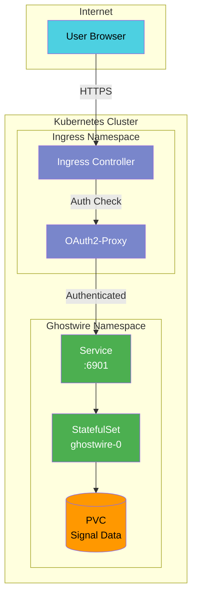

# Overview

Ghostwire packages Signal Desktop for Kubernetes deployment. Understanding the design decisions helps you integrate it effectively with your infrastructure.

## Design Philosophy

The chart focuses on running Signal Desktop reliably and staying out of your infrastructure's way. It doesn't replicate functionality that Kubernetes and your platform already provide.

**What the chart handles:**

- Container runtime configuration for Signal Desktop
- StatefulSet for stable pod identity and ordered operations
- PVC for data persistence
- Service exposure for VNC access
- Health checks and readiness probes

**What your platform handles:**

- Authentication (OAuth2-proxy, Dex, or similar)
- TLS termination (cert-manager)
- Ingress routing (nginx, traefik, or your preferred controller)
- Network policies
- Secrets management

This separation means less configuration overlap and fewer conflicts between chart-level and platform-level settings.

## Architecture

## StatefulSet vs Deployment

The chart uses a StatefulSet rather than a Deployment:

- Stable pod identity (`ghostwire-0`) for debugging and log analysis
- Ordered pod operations (important during upgrades with VNC sessions)
- Stable PVC binding (the same volume reattaches after pod restart)

Since Signal Desktop links to a single phone number, only one replica is supported.

## Container Stack

The container runs several components:

- **Xvfb** — Virtual framebuffer for headless X11
- **XFCE** — Lightweight desktop environment
- **KasmVNC** — VNC server with HTML5 web client
- **Signal Desktop** — The Electron application

Kasm Technologies maintains the container images. They're built on Ubuntu with security patches applied regularly.

## Data Persistence

Signal Desktop stores data in `/home/kasm-user`:

- `~/.config/Signal/` — Application configuration, encryption keys
- `~/.local/share/Signal/` — Message database, attachments

The PVC mounts at `/home/kasm-user` to persist the entire user directory. This preserves all application state across pod restarts.

**Important:** The encryption keys for your messages are stored on this volume. Losing the PVC means losing access to message history. Use appropriate backup and retention policies.

## Network Model

The container exposes port 6901 for VNC connections. The Kubernetes Service routes traffic to this port.

VNC traffic is unencrypted by default. In production, terminate TLS at the ingress layer. Don't expose the Service directly with `type: LoadBalancer` unless you've added TLS at the network level.

## Authentication Boundary

The chart doesn't include authentication. VNC access is open to anyone who can reach the Service.

For production:

1. Don't expose the Service externally
2. Route through an ingress with authentication (OAuth2-proxy, Dex, etc.)
3. Use network policies to restrict access to the namespace

See [Infrastructure Integration](infrastructure-integration.md) for patterns.
