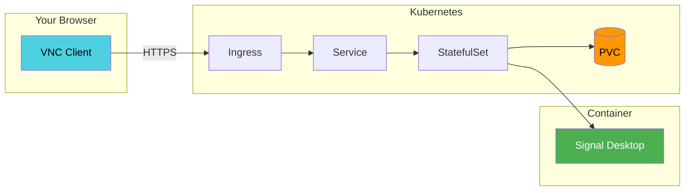

# Ghostwire

Ghostwire runs Signal Desktop in Kubernetes with browser-based VNC access and persistent storage. It's designed to integrate with your existing infrastructure rather than duplicate it.



## What It Does

Deploy a StatefulSet that runs Signal Desktop in a container. Access it through your browser via VNC. Your conversations persist across pod restarts through a PVC.

The chart handles the application runtime. Your platform handles authentication, TLS, and ingress—the things it's already configured to do.

## Quick Start

```bash
# Create a cluster
k3d cluster create

# Install the chart
helm install ghostwire oci://ghcr.io/drengskapur/charts/ghostwire \
  --version 0.0.0-latest \
  --create-namespace -n ghostwire

# Wait for ready
kubectl wait --for=condition=ready pod \
  -l app.kubernetes.io/name=ghostwire -n ghostwire --timeout=300s

# Access via port-forward
kubectl port-forward -n ghostwire svc/ghostwire 6901:6901
```

Open `http://localhost:6901?keyboard=1` in your browser.

## Why This Approach

Most VNC-in-Kubernetes solutions bundle authentication, TLS termination, and security controls. This creates configuration overlap and conflicts with platform-level tools.

Ghostwire delegates infrastructure concerns to infrastructure:

- Authentication through OAuth2-proxy or your identity provider
- TLS through cert-manager
- Routing through your existing ingress controller

The result is less redundant configuration and cleaner integration with what you already run.

## Documentation

**Getting Started**

- [Installation](getting-started/installation.md) — Prerequisites and Helm installation
- [Quick Start](getting-started/quickstart.md) — First deployment walkthrough
- [Configuration](getting-started/configuration.md) — Key Helm values and customization

**User Guide**

- [Deployment Strategies](guide/deployment-strategies.md) — StatefulSet behavior and rollouts
- [Infrastructure Integration](guide/infrastructure-integration.md) — OAuth2, ingress, cert-manager patterns
- [Persistence](guide/persistence.md) — Volume configuration and data management

**Architecture**

- [Container Runtime](architecture/container.md) — How Signal Desktop runs in the container
- [Security Model](architecture/security.md) — Security considerations and boundaries

**Operations**

- [Monitoring](operations/monitoring.md) — Health checks and observability
- [Troubleshooting](operations/troubleshooting.md) — Common issues and debugging
- [Upgrades](operations/upgrades.md) — Version upgrades and rollbacks

## License

The Helm chart is Apache License 2.0. Signal Desktop is AGPLv3 (Signal Messenger LLC). Kasm container images are MIT License (Kasm Technologies Inc).

Signal Messenger LLC and Kasm Technologies Inc do not endorse this project.
